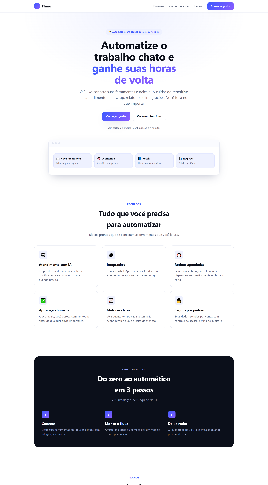

# Fluxo — landing page (protótipo)

Landing page de conversão para um **produto fictício** de automação ("Fluxo"). Construída do zero em
**HTML + CSS puro** (sem framework, sem build) para demonstrar design de página, hierarquia visual,
copy de conversão e responsividade.

> 🧪 Produto e dados fictícios. Sem rastreamento (nenhum GTM/GA/Pixel), sem back-end — é uma peça de
> portfólio de front-end/design.

## Preview

## O que demonstra

- **Estrutura de landing de conversão**: hero com proposta de valor, prova, recursos, como funciona,
  planos e CTA final — uma única meta de conversão.
- **Design system leve**: tokens de cor, botões, cards, tipografia fluida (`clamp`) e sombras coesas.
- **Responsivo de verdade**: grid que colapsa, nav adaptável e mockup que reflui no mobile.
- **Zero dependências**: um arquivo, abre direto no navegador.

## Stack

`HTML5` · `CSS3` (custom properties, grid/flex, `clamp`, `backdrop-filter`) — sem JS de framework.

## Como rodar

Abra o `index.html` no navegador.

---
Feito por **Allan Thurler** — design + código.
📫 allanth.designer@gmail.com
